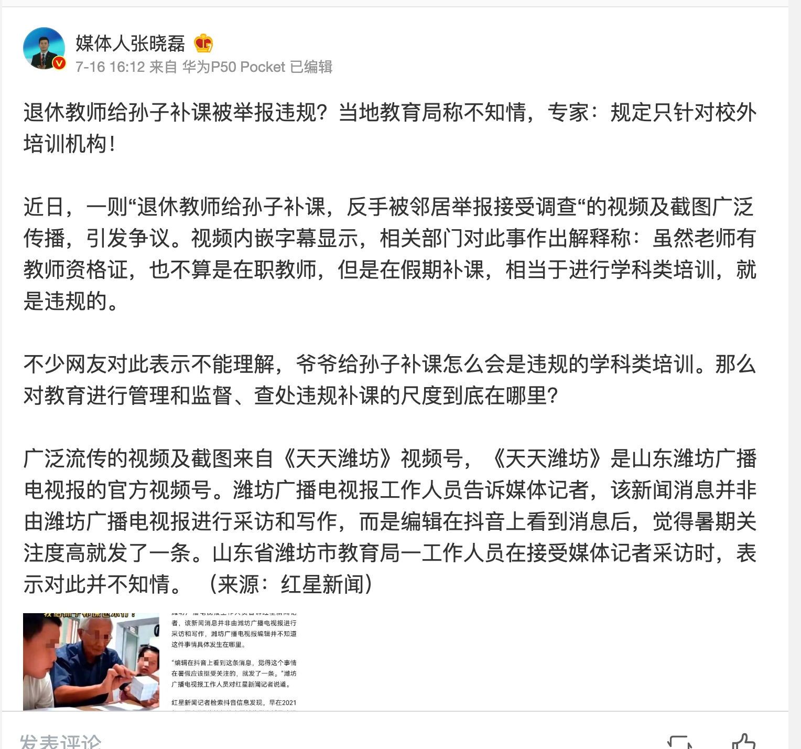
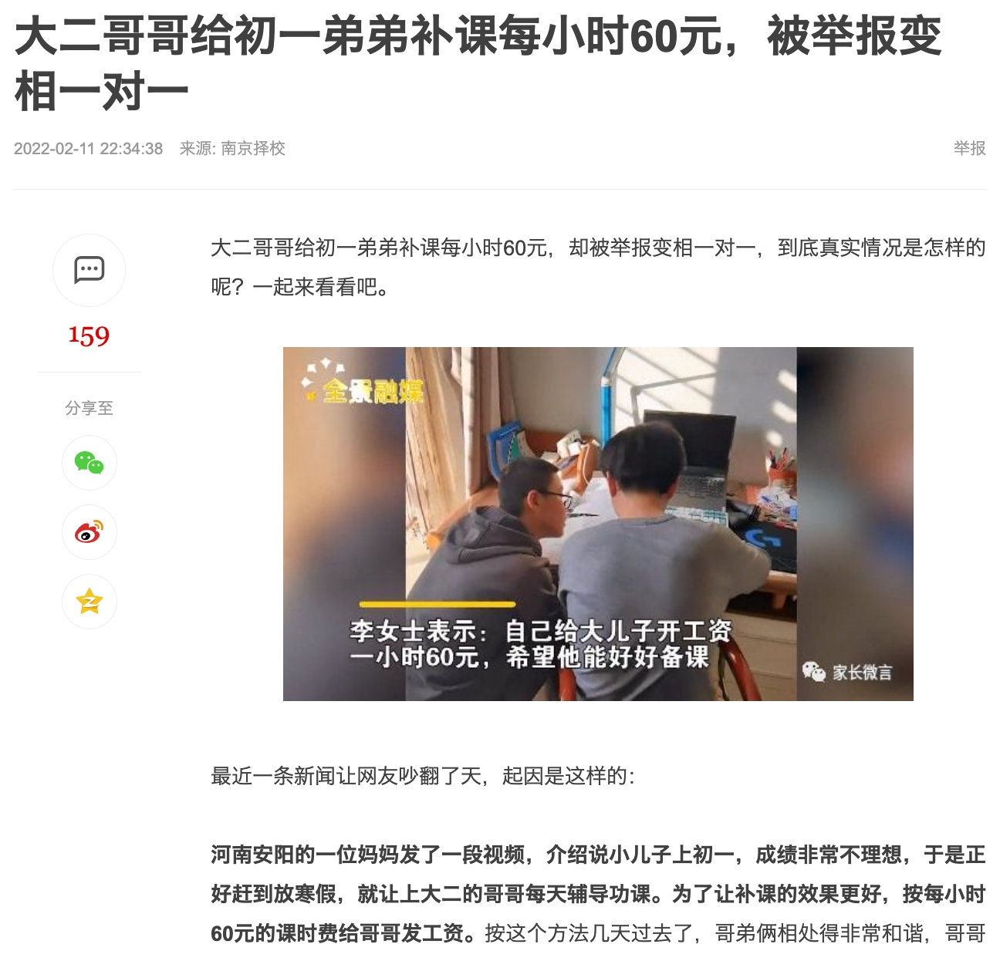
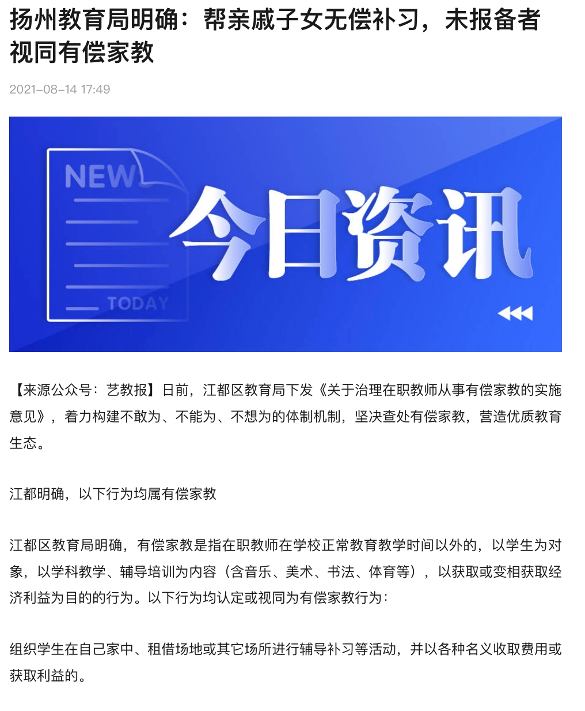

# 22年8月脑汁

### 20220826 | 竞品灌水

水一篇「基于心理疗愈机制的养成游戏」竞品分析，被web3巨头a16z投资的「a kinder world」

[【竞品】a kinder world - 心理健康的游戏机制](https://bytedance.feishu.cn/docx/doxcnAYlK3QMPR5pC1hK7odGbpd)

 \- - - - -

补充更新：玩了一周了，卵用不大；还不如冥想；可玩深度太浅了

### 20220826 | 区块链研究

最近零散的研究了一些关于区块链的知识，在这里用自己的话总结一下，作为记录；如果有不对，欢迎小伙伴纠正我。

- 元宇宙与他的八个特点

事实：元宇宙第一股Roblox总结元宇宙有8个特点：身份、朋友、沉浸感、低延迟、多元化、随地、经济系统和文明。 

观点：我把他总结成：身份账号，交易能力，社交能力，真实感。其中交易最大的问题是来自于信任成本。真实世界没有谁全知全能控制所有事件，但是虚拟世界厉害的黑客某种程度上就是「超人」。那么解决「安全-不可篡改」就是一件有价值的事情。

- 区块链技术与比特币

事实：2008年中本聪发布了《[比特币：一种点对点式的电子记账系统](https://nakamotoinstitute.org/static/docs/bitcoin-zh-cn.pdf)》

观点：我把这个论文拆解成「区块链+比特币」两样东西；区块链我理解中解决的是身份ID问题，比特币我理解是基于区块链的一种发放积分和积分流通的办法。

- 区块链

区块链实现了这么一个机制，所有人手上都持有一个「电话黄页」，这个黄页实时全量更新，当发生变更的时候需要全量投票确定大多数人都认可，那么所有人手上的黄页都发生变更。

通过这么一个机制，保障了每个人手上的ID是真实可靠的，发生的变化都是坦诚清晰无法欺诈的；因为如果欺诈，你需要欺诈所有人，成本贼高。（论文中有论述交易过程欺诈，和交易后撤回欺诈等多种情况；太复杂了不展开）

- 比特币与NFT

比特币是基于区块链（电话黄页）的「同质化积分」，每一枚积分本质和其他积分没有区别。一级市场的奖励机制不展开说，比较好理解，类比与激励的积分发放规则。二级市场很有意思，也是玩出最多花样的地方；需要解决两个问题，一个是交易广度，一个是交易速度。交易广度指的是「我可以用这种积分兑换什么」，交易速度其实值得是成本——当前交易速度实在太慢、门槛太高了。

NFT是基于区块链（电话黄页）的「非同质化勋章」，每一个区块，除了ID（创造时间）不同，内容也是不一样的（当然你可以存两张一模一样的图片，但是ID不一样）。我觉得当前NFT被泡沫化了，因为这玩意根本不能禁止盗版，盗版盗取的是内容，不是ID。。。

我会持续研究web3、defi等等概念，倒逼自己写文档，欢迎大家追更。

<blockquote>
更新：<cite doc-id="wikcnGmOyD4keR0Kb1LGHz8b77f" file-type="wiki" title="元宇宙思考" type="doc"></cite> 
</blockquote>

### 20220821 | 人口问题

最近经常从人口的角度思考一些问题，感觉很有趣。

背景：22年8月15日，普京签署总统令，恢复授予养育10个或以上子女的女性“英雄母亲”称号和勋章。

这玩意我眼熟呀，建国后，咱们也曾经禁止堕胎，并效仿苏联（1944年颁布过一次，现在是“恢复”）；五娃光荣，十娃英雄。这个政策从50年代一直延续到70年代，变成计划生育是我国基本国策。

思考不讨论制度设计，只是讨论这波设计后面会带来什么经济或者消费现象。

人口在制度鼓励下，形成了结构性的潮水。60年代婴儿潮，在80年代产生了回声，作为伪90后，我知道我这一代（87-92）是最后一代人口破2000w的孩子。然后就看到这群人潮做什么，经济机会就跑去哪里。

- 教育培训
- 高考扩招
- 消费升级
- 买房潮
- 买车潮

所有的机会，都是诞生于足够人口基数的土壤，叠加政策、科技、资本的因缘际会，催生了风口。

最近看到另一个新闻，说日本停止了3g，很多老人不会用手机了，感到生活困难。联想到日本之前互联网信息化的停滞，最终我认可“归因到老人的话语权太大”上。这种话语权，构建在人口基数、手中掌握的财富、政治活跃度之上。

我们也会走上日本一样的路吗？有可能，但是我还有3-40年慢慢变老呢，中间还会发生什么？

目前为止我只想出来了「医美」这一个项目，有钱不结婚的卷王们都3-40岁了，应该会火速卷入这场新的延缓衰老的军备竞赛吧。看美剧里面的5-60岁老男老女还长得那么精致，其实都是医美渗透率高的表现（怎么也能到10%的全名渗透），我国2008年才引进第一只玻尿酸，据说玻尿酸引进之后，大家才发现自己居然有那么多痣，带动了点痣行业的发展，哈哈哈。

那么还有哪些项目是35-45岁的人的需求呢？我觉得这个比养老行业更有意思，毕竟现在老的是50-60后，并不是最富裕的老人一代，最富裕的还是70晚-80后吧。他们在孩子上花了许多钱财，带动了许多行业，他们老了还会卷点啥呢？

搞钱，挺有意思的，大家怎么想

### 20220818 | 泡泡玛特要不行了

[https://dfscdn.dfcfw.com/download/A2_cms_f_20220816180029973692&direct=1&abc4655.pdf](https://dfscdn.dfcfw.com/download/A2_cms_f_20220816180029973692&direct=1&abc4655.pdf)

市场监管发布了《盲盒经营活动规范指引》

- 8岁以下不许买
- 概率需要记录备案，需要公布；记录需要保存三年，经得起检查
- 商品成本差价不能太大；鼓励消费者维权

根据我的经验，泡泡玛特快要不行了。。。

### 20220815 | 公平、均贫、均富

[[新闻]地理老师-航拍举报补课](http://k.sina.com.cn/article_1698823241_m6541fc49020016h64.html?cre=videopc&mod=zixun&loc=5&r=0&rfunc=66&tj=cxvertical_pc_videopc_zixun&from=edu&sudaref=www.google.com.hk&display=0&retcode=0)

[新闻] 近日，浙江杭州一高中地理老师符新平航拍多所地市高中，反映暑期疑似违规补课。符新平称，希望能借此促进省级层面进一步落实相关减负政策，防止内卷。多地教育局否认有补课行为。

- 他举报浦江中学；浦江教育局说高三学生补就补了
- 他举报泰顺中学；泰顺中学回应当天是优秀校友与学生交流
- 他举报苍南中学；不幸无人机坠机...

他游走了周边一圈，作为杭州的老师，对于杭州的学校却没有举报。

还有很多有趣的现象

<grid>
<column width-ratio="0.364082">

</column>
<column width-ratio="0.354062">

</column>
<column width-ratio="0.281856">

</column>
</grid>

这些举报人有一个特点，自己往往也有孩子，也需要教育，本来也需要补课。现在不让补课了，别人孩子也不许他们补课。这种举报有用吗？我想大概率是没有用的，偷偷补呗，我把门关上窗帘拉上隔音棉铺上你还能咋地？

是不是以后成绩好就要被举报自证清白？

回溯一下，这一切是怎么来的？是不是本来希望教育公平，或者说，有足够的、不稀缺的资源供给所有人？像极度富裕的未来社会那样？

矛盾本来是什么？是不是稀缺资源和不平衡之间的矛盾？

我们的策略是什么？是不是把资源搞得更稀缺了？

公平有两种，均贫和均富；既然均富太难了，那就大家一起均贫吧；反正幸福感是比较出来的，哈哈哈

### 20220814 | 习惯与主客体分离

看了宇航的「主客体分离」帮助自己坚持抵抗负面设计对生活的侵占，我发现「习惯」这个词非常精妙，惯和惯性联系在一起，是不施加外力时事物的一贯方向与速度不变化。最轻松的运动就是匀速直线运动，因为不需要任何外力它也可以一直存在下去。

类比生活中，我们往往寻求改变，那么改变施加在「环境」中是最轻松的、最长久的，可以造成新的习惯。而具体一次性的「施力」往往只会造成短期的，一次性的改变。

- 下周要当伴郎了，减肥1周
- 周五要考试了，突击学习
- 明天ddl，今晚加班
- 上午要体检，今晚早点睡

长久习惯的改变，看起来着力于不直接相关的事项，但是由于「惯性」的存在，最终走的距离可能比一次性的改变要长远得多。

- 不吃晚饭了，改健康餐
- 每天check自己的todolist，思考该提前学习还是提前完成任务
- 早上早点起来玩自己喜欢的东西（抖音/游戏....)

这种惯性的利用，某种程度也是对「什么也不思考惯性去做事」这种轻松的利用；不一定随时都需要主体思考，保证check自己良好的习惯，去利用这种轻松也是一种选择。

### 20220810 | 太阳下无新鲜事

太阳下无新鲜事+信息不是太少而是太多了

对标类似拼多多农场和蚂蚁森林的玩法做的差不多了，随便问一下，就有之前杨帆做的果肉网校互动游戏可以借鉴，远有20年启动的抖音主播养猫猫项目可以借鉴。不禁感叹太阳下没有新鲜事，所有的事情都是历史的变种。

<blockquote>
<cite doc-id="doxcndZNIRIAQsDWH6nSC6MKQ2e" file-type="docx" title="拼多多果园和农场逻辑分析" type="doc"></cite>  <cite doc-id="doxcnGTJ7WGrKqJQgVrit5yAdPE" file-type="docx" title="蚂蚁森林 &amp; 蚂蚁庄园 研究" type="doc"></cite> 
</blockquote>

想到创业也是这样，前段时间有个朋友跟我说他的点子希望我给点建议，但是关键的部分模糊其词，我自己检索一下就发现若干个类似的项目存在。发给朋友，朋友直呼「卧槽」。

太阳下面没有新鲜事，我们在tw演训不是第一次，美国议长访问tw不是第一次，美股大跌7%不是第一次，大cy/大萧条也不是第一次。

以史为镜可以明得失，并且当今世界信息大爆炸，噪声往往比真实数据还要响亮。前两天看概念「过拟合」，原来过拟合就是训练集里面机器只学到了噪声的规律，因此在训练集表现贼好，但是在新输入下正确率低的离谱。

但是我们怎么避免过拟合呢？除了全知全能的神，可能信息也救不了大家，大家还是知道很多道理，依然过不好这一生。

### 20220808 | 幸福是什么

什么是幸福？

刚刚接到老朋友的电话，他谈笑着跟我说他最近老婆出车祸进了icu，问我一些法律上的事情；然后我突然觉得其实我们只要是健康快乐的就是幸福的，联想到前两天一个朋友抑郁症复发，但其实客观上说我觉得他过的挺好的。我在思考一个问题：生产力和幸福感之间真的有必然联系吗？

韩国是发达国家，教育出海调研后我发现，韩国是世界上最卷的发达国家，每个人都在卷。朝鲜是落后国家，我不知道他们幸不幸福。无知是福，无知的福比有知的福程度轻吗？

想起来爱死机《虫族》那一期，虫族女王说智慧不是进化的必须。生产力是幸福的必须吗？如果说生产力和幸福之间有一个函数关系，公式会是什么？

我也没有答案，只有一些感慨。

### 20220807 | 推荐冥想

对于冥想的推荐。

我觉得冥想是有助于提升我的精神敏感性的。这里先定义我所说的冥想，指的是「刻意集中在当下感受，并不评判」的练习。

例如：

- yes-禅修派，提醒你关注自己当下的呼吸是冥想；提醒自己观察食物，品尝食物，全身心体验自己咽下去食物是冥想；冥想的时候只关注过程，不关注「推理」或者「评价」，超然于物外
- no-听一些鸟鸣，进入空灵状态，或者白日梦状态，有「忘我」的体现，不是本期说的冥想。

我个人的体会是，当我经常能进入「知我，不忘我」的状态时候，日常面对一切变化，能够更频繁的进入「超然的视角观察自己」的状态。例如公交上有人踩了我一脚，我的体验是「哦，有人踩了我一脚」「有一点疼」「我可能要生气了」「我生气的原因可能是xxxx」等等，这种体验我个人认为能很好地帮助我控制情绪，维持稳态，并且能更敏感的面对自己的变化。

欢迎有兴趣的同学共同参详。

### 20220805 | 习惯的反面：警惕渐进性滑坡

维持了两周的健康餐在这周被摆烂式打破：周三周四周五连续或者夜里或者中午吃了油腻但美味的食物。第一顿的时候我还觉得没事，这就是本周的欺骗餐了。两顿欺骗餐也尚可接受。但是每天都欺骗自己的话不叫欺骗餐，只能称为大骗子。

睡眠上，我有一个朋友（手动狗头）总是2-3点睡，有那么几天晚了半小时，第二天又晚了半小时，第三天又晚了半小时。两周后，作息已经变成4-5点睡了。（不过我这个朋友精神很好，就是怕猝死）

这两个案例让我想起「温水煮青蛙」的故事（btw：这个故事是假的，已被实验证伪），又让我想到「习惯的力量」。如果说我们的希望是飞到天上，那么这个世界似乎存在一种「重力」在悄无声息的把我们往下拉，从人性向动物性拉，从熵减到熵增拉。这件事就像气压一样难以察觉，但却无处不在，一旦习惯就会逐步滑坡，直到恍然惊醒已经走到山脚。

怎么应对呢？

我想到的是「冥想」或者「复盘总结」，通过复盘（觉察和复盘的区别回头有机会单聊），察觉自己正在顺从重力或熵，从而具备青蛙跳出火锅的可能。当然，从人生快乐的角度，意识到但仍然选择拥抱这种快乐一段时间我认为也是可以的，毕竟谁会拒绝一锅美味的牛蛙火锅呢？（关于幸福课和成功学的矛盾有机会单聊）