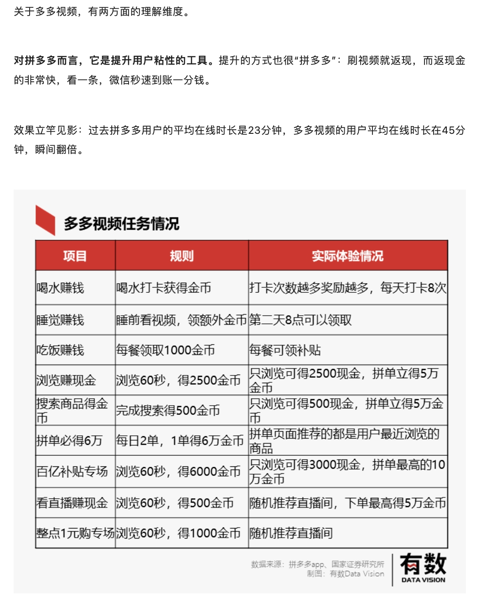
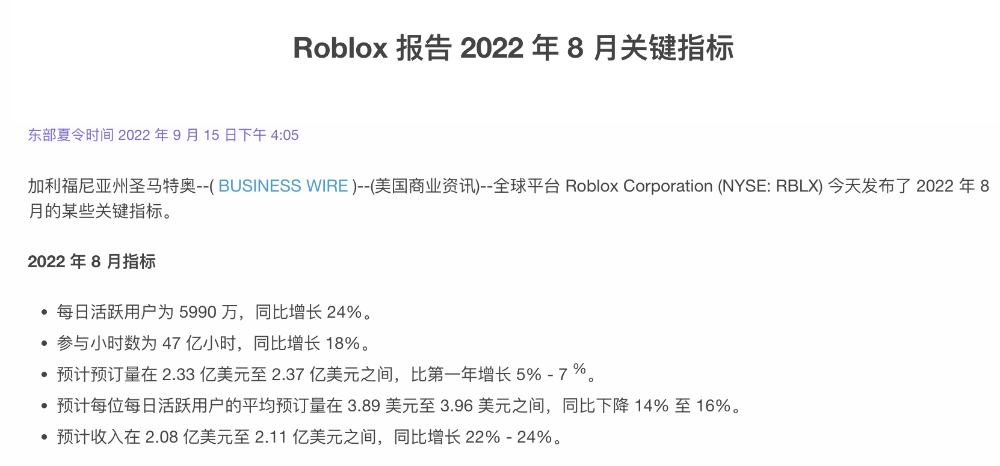
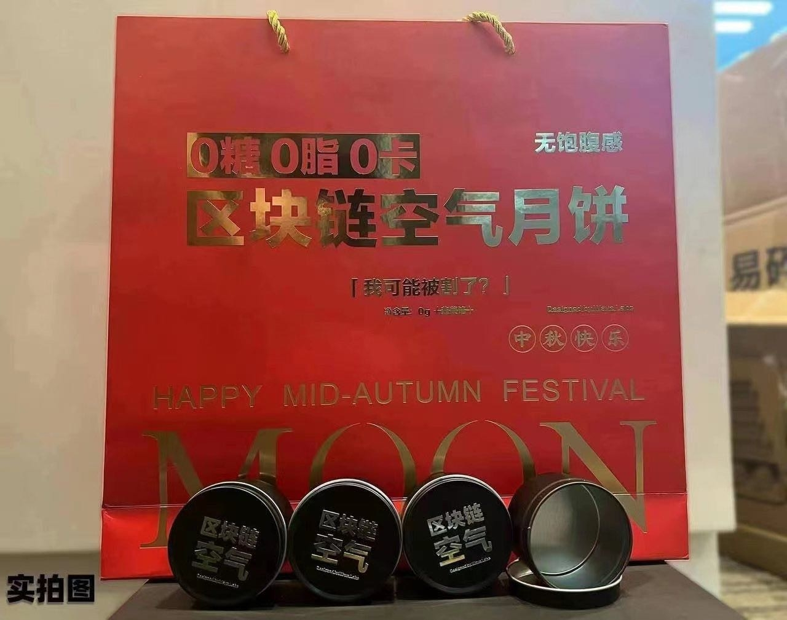
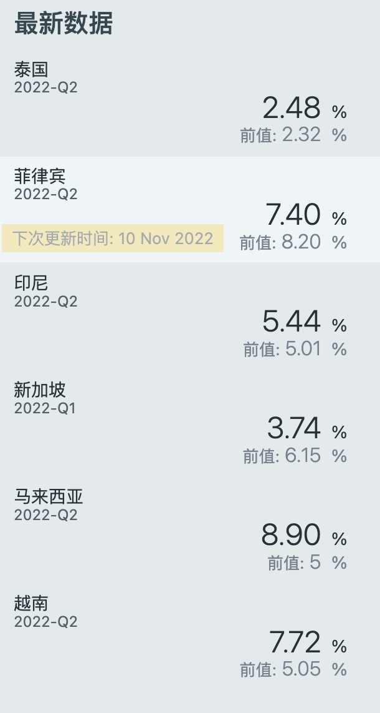
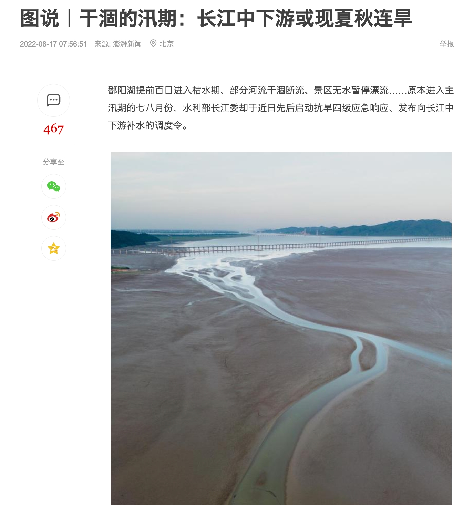
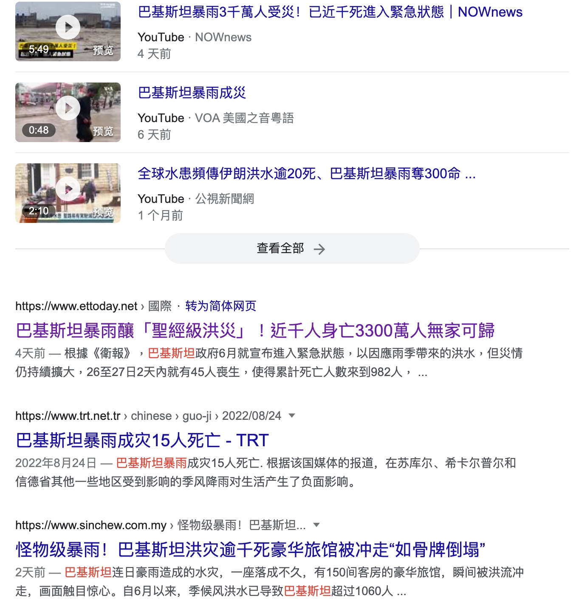
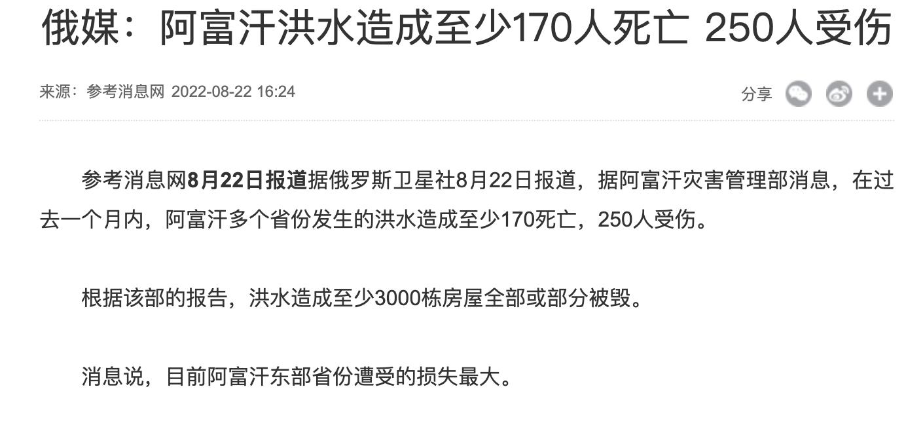
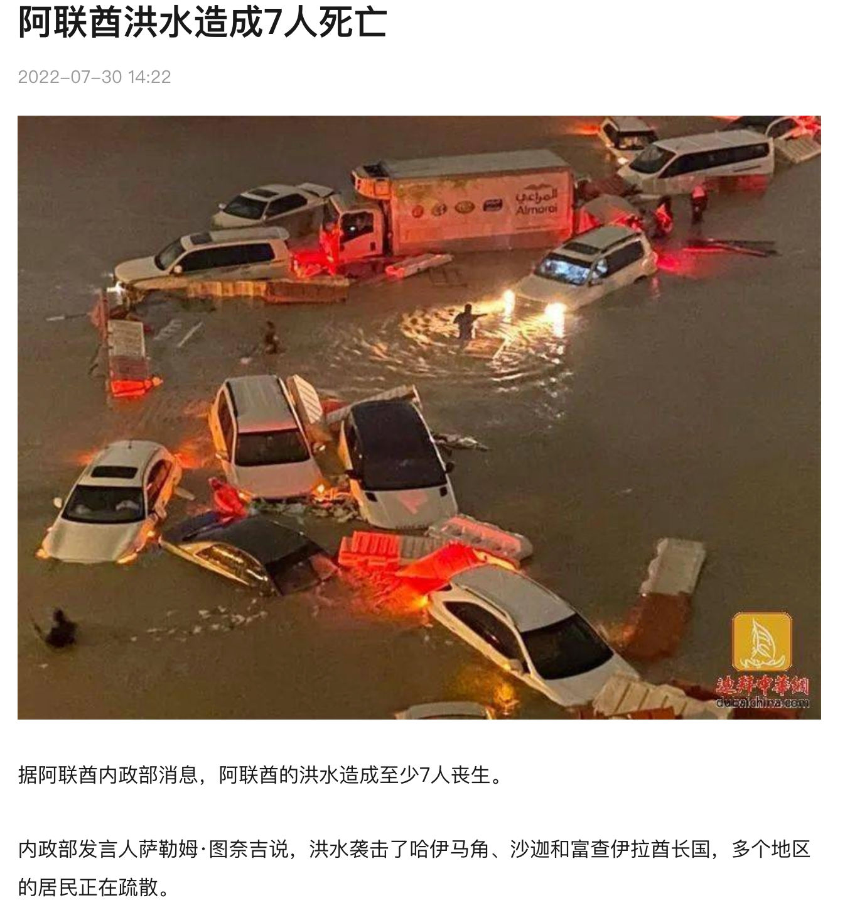
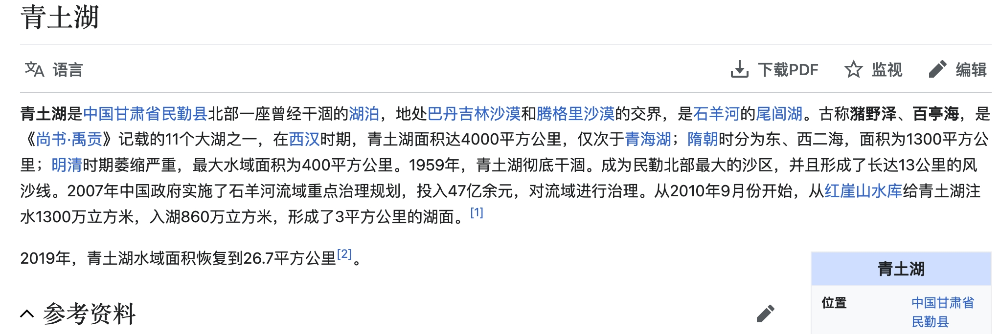

# 22年9月脑汁

### 20220929 | pdd真牛逼

我觉得pdd是个很有趣的案例，尤其是对「激励」和心理动机的洞察，我认为是行业领先的。pdd这个公司的文化很有趣，叫做「本分」，又称为「本分厂」。他做的设计也非常的「简单粗暴但有效」。

案例：

- 在「红包雨」中，我先做过电商红包雨，设计的雨滴落下速度尽力模仿自然界，快速不好点，有一定游戏性；后来发现pdd上线的红包雨，雨滴特别慢，老人也可以全部点中。我动用「慢思考』后认为pdd做法更本质——既然奖品其实与点击多少雨滴无关，往往是运营需求驱动，那么让所有人都感到『爽』是更合适的，开发成本也更低。
- 在某春节，pdd小组长神秘兮兮让员工春节自愿上班，小声说『有好处』。来的人一人xxk大红包，过年7天，xx \*7。员工一遍骂娘一边主动去。pdd至今员工数未破万，还有『粪厂』臭名，但是员工吐槽率高、跳槽率不高，我认为也是很粗暴但有效的人力资源第一性思考。
- 再就是以上激励案例。pdd发奖励喜欢直连微信红包，告诉你『恭喜中奖获得2分钱』，然后叮咚，微信到账2分钱。本来虚拟的钱突然有了真实的摸样，非常牛逼，以小博大。从而也给pdd养成了『我就是实在、本分』的品牌气质。

不一定在任何场景都适用，但是第一性原理、奥卡姆剃刀、简单粗暴但有效的思路我认为还是非常有启发的。

### 20220925 | 外卖迷思

我发现一个需求，其实还是比较刚性，但是我个人觉得并没有得到很好的满足——外卖选餐。

我经常会陷入：

- 啊 我该吃什么
- 这个看起来真不错，点一点试试看
- 我曹100+块
- 换一个，这个看起来好清淡
- 换一个，这个emmm评价一般/有快递费/凑不齐来单

然后选了一家「曾经吃过」的店铺，点击了「曾经吃过的」饭菜，往往还是我喜欢的不健康口味，比如麻辣香锅或者鸡排。

然后，系统识别「这是个重口味胖子」，陷入无穷无尽的垃圾食品陷阱，就像我的抖音满是低俗段子、极限运动、猫猫狗狗一样。

但是今天被朋友拉到楼下去吃了一家「我自己走过绝对不会进去」的山西面馆，意外的还不错。

我现在开始怀疑AI和推荐包围的世界，「真的是我想要的世界了」吗？

但是依然没有特别好的办法解决：85%的熟悉+15%的意外美好  的外卖状态。也许需要全新形式的内容推荐？

### 20220924 | 自如搬家服务真好

搬家又一次找了自如搬家。自如搬家服务现在非常标准化，体验流程很好。搬家师傅甚至有“专业偶像包袱”，觉得没有东西是不能搬的。于是我就让他把桌子和镜子搬了。

我觉得搬家师傅说的很好，专业人做专业事，效率会得到极大地提高。我也觉得信任成本是交易中最大的成本。说实话师傅在跟我说他啥都能搬的时候我是不信的。

这就又让我想到区块链，我认为区块链可能最大的价值不在于“去中心化”而在于“不可篡改” 如果交易所有记录都会跟随一辈子，我觉得信任成本会极大降低，从而促进了交易。

### 20220918 | roblox初探

老说元宇宙鼻祖roblox，我最近想要体验发现中国区已经关服半年了。。。22年1月，腾讯投资的roblox中国区「因为一些升级原因暂停服务，我们一定会回来的」，这已暂停就是半年。

于是我就去看了看roblox是不是已经凉凉了——并没有，22年8月最新数据日活已经6000w了，这还是在没有中国大陆的情况下；国服运营一下，又是一个全球日活破亿的游戏呀。

看来这个概念还是值得buyin的，顺便看了下ios美服商店评论460w+，已经是冒险类游戏第一名了；苹果商店的各种list推荐里面都名列前茅。

突然想起了「魔兽世界」不和全球服同步的日子。。。（死去的回忆开始攻击我）

### 20220910 | 中秋空气月饼

记一款数字月饼的诞生：[记一款数字月饼的诞生](https://mp.weixin.qq.com/s/uKVrJdbJAA3BZqAKCeEYcQ)

我真的要祭出这张图

我本来以为只是个玩笑，没想到啊没想到，居然是真的。

作为玩笑，我本来觉得非常有趣，「0糖0脂0卡」的月饼，我觉得很有噱头。我本来以为没有人会买单。

但是打听了下，数字月饼卖的居然还不错；我就不能理解了。。。

仔细想想，之前b站商业化之路一直不太顺遂，大家疯狂整活狂欢，但是屌丝用户一直不愿意掏钱。

现在想想，是不是韭菜们都变得有钱了，所以不管怎么割都能割到汁水？

也不对啊，经济不好不是说韭菜都躺平了，不好割了么？

这么想想，应该也是一种财富焦虑的外化，大家又想赚钱，又不知道机会在哪里，于是就跟渣男似的，广撒网，万一成了呢？

### 20220904 | 分裂的世界

水一个最近看到的一组新数据（来源：[https://sc.macromicro.me/charts/804/asean-gdp-growth-rate](https://sc.macromicro.me/charts/804/asean-gdp-growth-rate)）

东盟作为一个区域经济体，总量达到3万亿美元，增速是超过5%的

结合最近一个好友去越南，最近关注了更多的东南亚新闻，震惊的发现很多抖音神曲居然是越南出品

（都给我去听！老营销号了！）[六首爆火全网的越南神曲，虽然听不懂歌词，但是旋律已经刻在DNA #越南 - 抖音](https://www.douyin.com/video/7122429993153596686)

我觉得非常有意思，这种感觉类似于第一次感受到pdd和快手的影响力；对于这个国度之外的事情，我们又何尝不是一个小白呢，啥也不懂。

- 五环外的消费者；《隐入尘烟》
- web3；区块链
- 东盟、北美、地缘zz

这个世界真的是老有意思了，层出不穷的新鲜玩意。探索新玩意，发现和以前认知不符的事实，我感觉就是我个人的兴趣所在。

### 20220901 | 沧海桑田与二元思维

今年夏天，整个长江流域大旱，鄱阳湖洞庭湖见底。我在想一个问题：水都在地球；气候变化下水没有留在长江，那么水去哪里了？

不久我就看到了答案：水汽西移

<grid>
<column width-ratio="0.238119">

</column>
<column width-ratio="0.527710">

</column>
<column width-ratio="0.234171">

</column>
</grid>

青土湖于上世纪50年代彻底干涸，形成长达13公里的风沙线，传说为中国四大沙尘暴发源地，从10年开始至今重新换发青春，如今已经是5倍西湖大。

曾经的丰沃水域干涸，历史的沙漠绝地爆发洪水。

我们，正在见证新时代的「沧海桑田」。

感慨之外，这种「二元」思维方式我认为对产品思维也大有裨益：追问一个现象背后，二元的影响面是什么？

- 都说房地产是「沉淀滥发的纸钞」；钞票不会消失，只是转移，那么房地产在其中究竟起到了什么作用？（我的答案：房地产是信用印钞机）
- 都说计划生育是「解放了妇女劳动力」，但是本来会产生的儿童消失了，那么「计划生育」政策的本质是什么（我的答案：生产力透支工具）
- 都说阿里巴巴「搞得中小商家生存更加困难，行业内卷」，那么阿里巴巴对行业生态提供的价值是什么（我的答案：降低交易成本）
- 滴滴司机和美团跑腿会吸引劳动力，核酸检测也会吸纳劳动力；从就业的角度，他们有什么区别（我的答案：市场与计划）

任何一个决策都会有「反身性」，如果揪住一个现象不放，那么很容易陷入细枝末节的影响对大影响因子视而不见。

任何一个个体都有视角盲区，每个人都有自己的局限性，有自己的「全局」。意识到这一点，总比意识不到好。

希望这种思维，在我碰到下一个旱灾的时候，也帮我找到下一个绿洲

看到一句话：泰坦尼克号沉了，对人类来说是一场巨大的灾难，但对船上餐厅里活着的海鲜来说就是生命的奇迹。