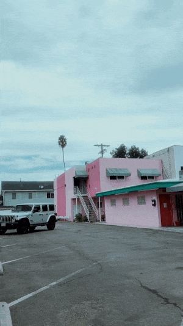
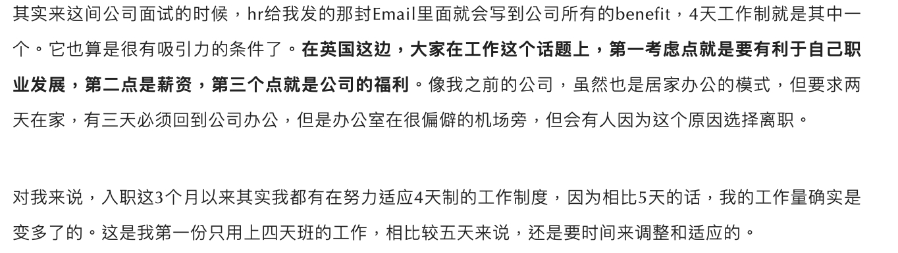
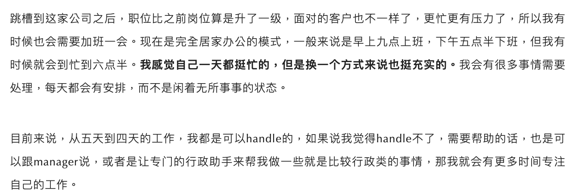
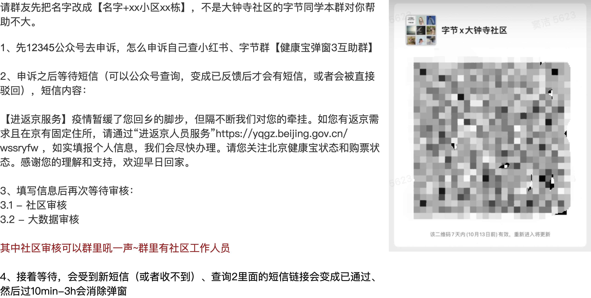

# 22年10月脑汁

### 20221027 | 元宇宙飞机bei

[大受震撼！网易春风推出“元宇宙”Ai飞机杯，可多人在线PK？！](https://mp.weixin.qq.com/s/JQt0C5BJt0TkW8sGMt-b2A)

元宇宙和激励机制的奇怪示范：飞机杯元宇宙+手冲排行榜

怎么说呢吧。。。大家还是看文章内容吧

评论：这一波我觉得算是找到了一个虽然奇怪，但是有爆点确实也有需求的社交场景，如果接受这个设定的话，感觉做的还是很不错的。

### 20221021 | AIGC

AIGC（AI生产内容）的世界正在以每周为里程碑进化，强烈安利大家都关注一下这个行业。以下这张动图中包含了我对这个行业的敬畏与恐惧，以及向往这个行业成熟后在教育、游戏、娱乐甚至元宇宙等业态中爆发出的巨大潜力。也许这个时间点比我们想象的要更快，也许奇点已来。

[推荐阅读：AI时代的巫师与咒语](https://mp.weixin.qq.com/s/OE3BOtAqVC7tK_rBInJ9hQ?from=groupmessage)

### 20221021 | 元宇宙

<cite doc-id="HBRtdEMacoAiQcxWli3c27e6n0b" file-type="docx" title="抖音小窝上线，快手内测虚拟社交，元宇宙社交真香？" type="doc"></cite>

看到越来越多的产品开始搞宠物、小窝、捏人，但是我依然觉得场景非常不足。

我心目中的头号元宇宙产品，是2005年左右出品的《魔兽世界》，他真的能做到让我和我的朋友更愿意待在艾泽拉斯大陆社交，哪怕看看风景也好，在暴风城逛一逛也好，钓钓鱼都好；而不是现实去约公园。我自己对元宇宙的定义如下：<cite doc-id="wikcnGmOyD4keR0Kb1LGHz8b77f" file-type="wiki" title="元宇宙思考" type="doc"></cite> 

最近看AI的一些进展，我越来越觉得AI绘制世界将是roguelike元宇宙的必备， [今年最火的是文本生成图片，但现在文本生成视频也初露锋芒，有点像去年的生 - 抖音](https://v.douyin.com/MPrbb74/)

期待有一天，元宇宙中的 你说要有光，于是就有了光。

### 20221018 | pdd真牛逼\*2

[拼多多Temu击穿SHEIN的地板价，对跨境生态意味着什么?](https://baijiahao.baidu.com/s?id=1743998784428061816&wfr=spider&for=pc)

pdd最新电商产品temu已经appstore前十了。（更新，18日已经总榜第六，购物榜第一，打败亚马逊）

便宜好货快捷售后好，看来是电商本质全人类都逃不过的真香。

而其他的噱头不过是锦上添花罢了。

教育的本质是什么？我猜是 内容清晰易懂 安排循序渐进 引起兴趣 方便效率高，大家觉得呢。

### 20221014 | 四天工作制

[「四天工作制」，我想到了会很爽，但没想到这么爽](https://mp.weixin.qq.com/s/6xjRjNMzddL6mXq1-6870A)

大家可以感受一下，今天周五，如果我们是四天工作制，今天放假，明天也放假，后天还是放假。

<grid>
<column width-ratio="0.537847">

</column>
<column width-ratio="0.462153">

</column>
</grid>

什么样的条件可以实行4天工作制呢？我想可能是工业时代向创意时代发展到一定程度后的产物。因为时间和重复劳动是一定成正比的，比如富士康可能是最后一批四天工作制的公司，而建筑行业或者文创行业可能本来就非常弹性。

之前读过一本书，《卓有成效的管理者》说「管理者」不是说管别人才叫管理者，知识工作者都是管理者，管理者的特点就是工作产出不能被时间量化，而是要看结果，时间和结果之间相关性并不显著。比如你看老板在办公室发呆了两天，可能拿出了非常牛逼的方向规划，但是他要是一直开会写材料，可能并没有什么卵用；类似的还有医生、律师、研究人员。某种程度上，产品经理叫「经理」并没有毛病。

知识工作者面对4天工作制，可能效率不一定下降的情况下，人的精力得到释放，从而在经济活动上解绑创造更多的消费。这么算总账是划算的。不过也有可能效率下降了。。

总之这是近期我见过比较有意思的社会实验，我很期待看到社会学经济学的实验效果验证，到时候说不定还能拿诺贝尔奖呢┓( ´∀\` )┏

持续关注ing

### 20221006 | 自治

这次返京过程略微曲折，但是在过程中涌现了大量的居民自助行为，非常有意思。

- 有出行去哪里的群，有哪里不弹窗小程序、公众号、抖音小红书，野火烧不尽
- 有返乡弹窗群，群里可以拼凑倒推出弹窗逻辑
- 甚至后面涌现出一些社区自助群，打不通电话就给上级接到反馈，最后加上主任微信

这让我想起了上海封城期间的团长，让我想起了更久远一些的居民自治组织。

基层社区工作者很辛苦，我知道；但是民间自助组织因为是和自己有切身利害关系，所以更加的「与我有关」，反而更有责任感，或者给大家更多的选择权。这何尝不是一种「以我为主」的初级萌芽。

这让我想起之前有言「我们国民素质不行，很多事情不能搞」，其实还是可以试着搞一搞的，哈哈哈。

### 20221004 | 科技改变生活

骑电瓶车，还车的时候居然提醒我：停放车头要冲着马路，屁股对着人行道；车头没有摆正，歪的幅度超过15度无法停车。我试了下，真的无法停车。。。

测核酸的时候，我问身份证照片可以不可以，核酸工作人员说，要么身份证原件，或者健康码扫码，你有健康码为啥还给我看身份证。。。

回想起杭州市第一批支付宝刷卡乘地铁、乘公交，第一批扫脸支付，我不得不感叹：北京基础设施上正在被同龄人抛弃。。。

### 20221001 | 杭州出站有感

杭州东站出来，必须要测核酸，登记个人行程信息，签承诺书。

先是杭州朋友提醒我，大概9点钟人最多疯狂排队的时候有东北人骂骂咧咧快打起来了。我调整了下车要排队很久的心理预期。

然后我自己体会还是比较有次序的，大概40分钟搞定。

最后觉得感觉特别像出国…

感慨，世界在不知不觉中已经变化了…