# 元宇宙思考

2022年10月27日

### 一、什么是元宇宙，以及一些示例

##### **1、我的定义**

本质是原子现实和比特世界的混合，是现实世界被拓展、升级

> 1992年的《雪崩》第一次提出了Meta的概念，想象出了这么一个元宇宙

<grid>
<column width-ratio="0.719716">
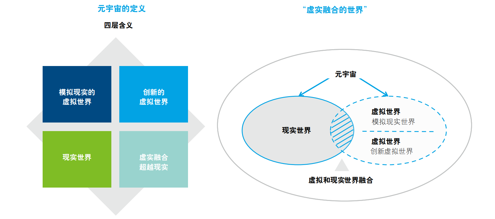
</column>
<column width-ratio="0.280284">
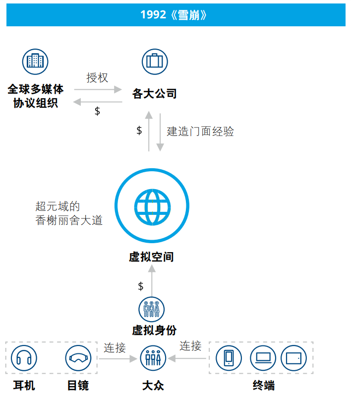
</column>
</grid>

##### 2、一些示例

- **游戏元宇宙：**往往是虚拟现实的，在全新的世界中自由探索场景、打怪升级、社交、解密等。在我心中，以魔兽世界为代表，已经算是一个虚拟的世界了；当前典型则是roblox-6000wdau。
- **社交元宇宙：**往往是虚拟现实的，在全新的世界场景中，结识不同的人，一起参与组队、对抗、分享、聊天等活动。在我心中，以VRchat为代表，已经是社交元宇宙。

  > 大家有空可以看下，知乎上有很多VRchat的暖心故事，学习英语的、听故事的、残疾人专属聊天室等，甚至有人找到了对象；但这类故事在魔兽世界里面其实也有，有人的地方就有江湖。  
  > [如何评价游戏《VRChat》? - 知乎](https://www.zhihu.com/question/56197475)

  <grid>
  <column width-ratio="0.300000">
  游戏-魔兽世界-十观景圣地
  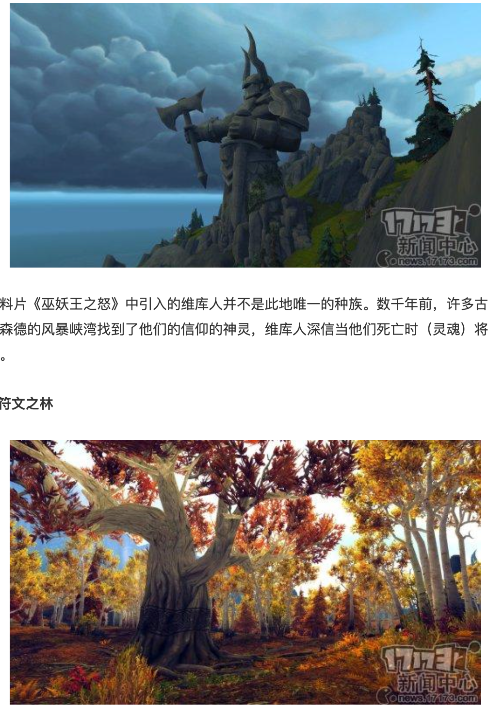
  </column>
  <column width-ratio="0.350000">
  社交-VRchat-各色聊天室
  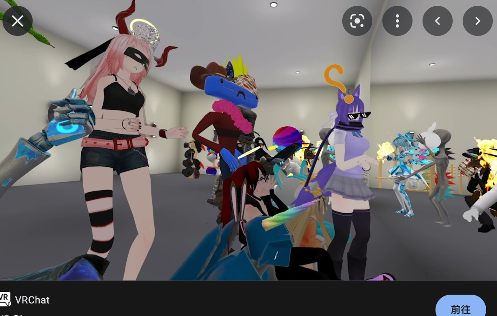
  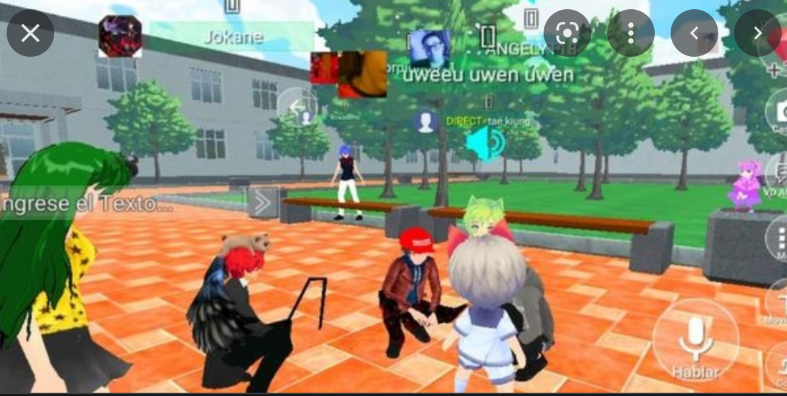
  </column>
  <column width-ratio="0.350000">
  游戏x社交-Roblox-极其粗糙
  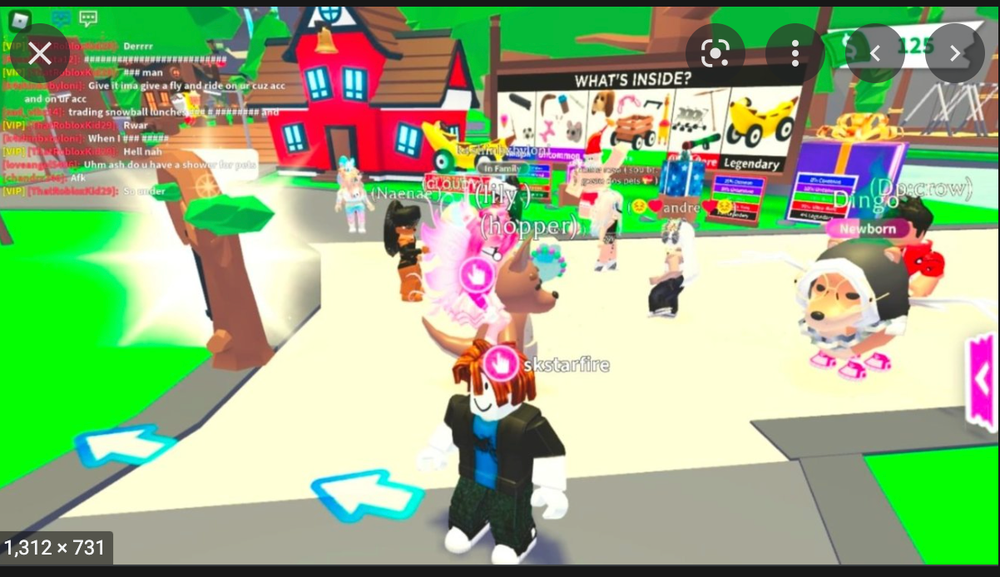
  
  </column>
  </grid>
- **电商元宇宙：**往往是增强现实的。又分为两种。

  - 交付的是现实物品。在现实的场景中，通过增强现实假装已经「获取」了物品，从而感受到物品的材质、外观、摆放在特定位置的效果。以得物的「鞋子上脚效果」为典型，或者酷家乐的装修效果为典型。
  - 交付的是虚拟装扮。在现实的场景中，通过增强现实直接交付「虚拟装扮」，从而感受到你虚的材质和外观，往往固定着装于身体上。以腾讯「幻核」、字节「沸寂」为典型案例

  <grid>
  <column width-ratio="0.250000">
  字节沸寂
  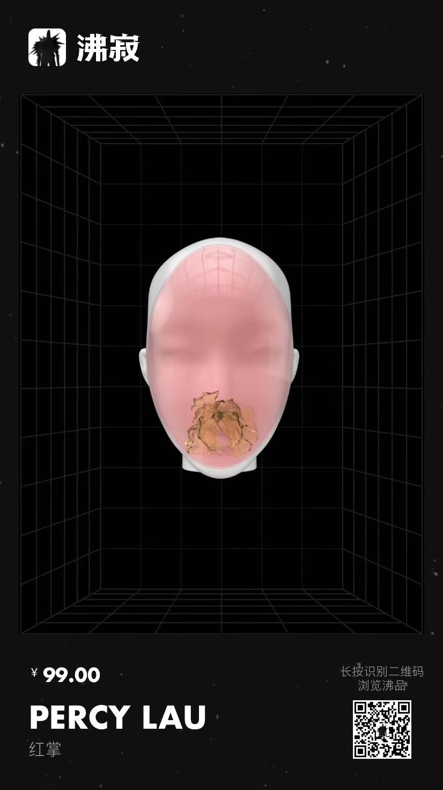
  </column>
  <column width-ratio="0.250000">
  舍不得花钱 看模特吧
  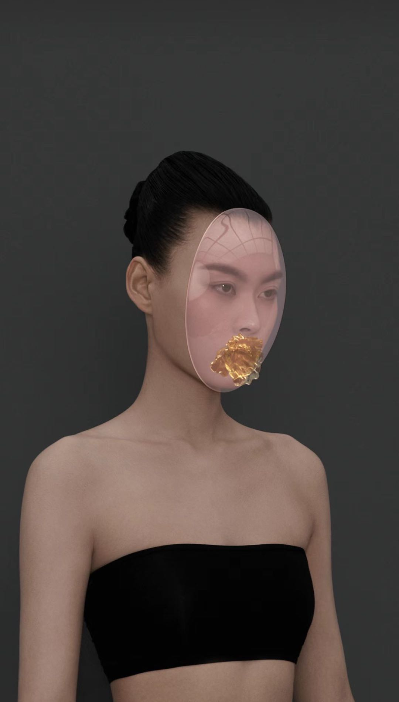
  </column>
  <column width-ratio="0.250000">
  得物鞋子上脚效果
  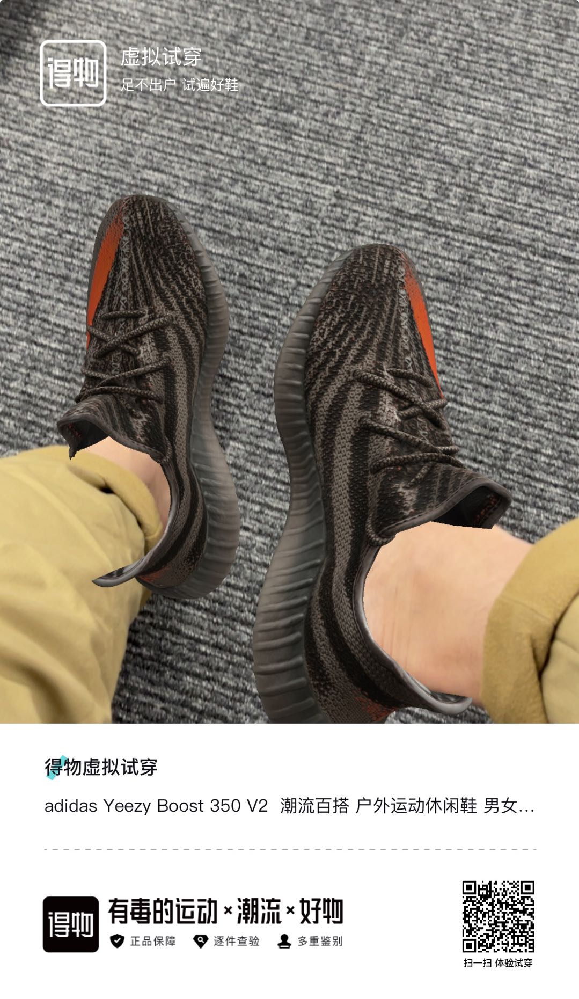
  </column>
  <column width-ratio="0.250000">
  淘宝AR试妆
  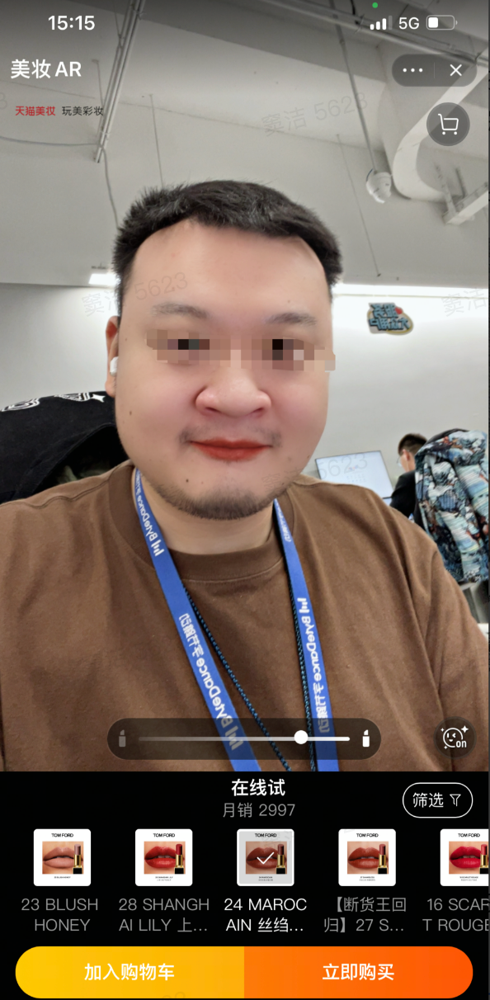
  </column>
  </grid>
- **产业元宇宙：**

  - 腾讯提炼出「全真互联网」概念，大意是突破产业互联网，用增强现实辅助教育、医疗等行业，但是并未明确做什么，怎么做
  - 百度息壤，当前和政府各种合作做会展，示例[百度VR《息壤》\_哔哩哔哩_bilibili](https://www.bilibili.com/video/BV1eQ4y1D7LN/?vd_source=b835fc301ff5f9ea79760b9f54b34cc7)
  - 网易几个元老现在在创业的「方糖星球」走和百度类似的路线，和政府、高校合作，在疫情期间做线上会展

  <grid>
  <column width-ratio="0.545326">
  百度息壤：搞产业园
  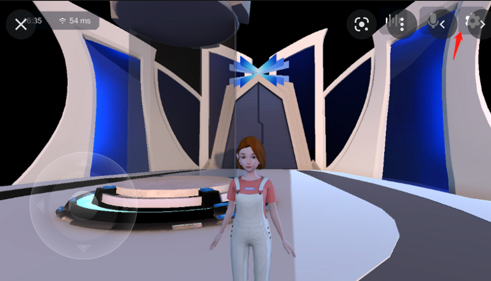
  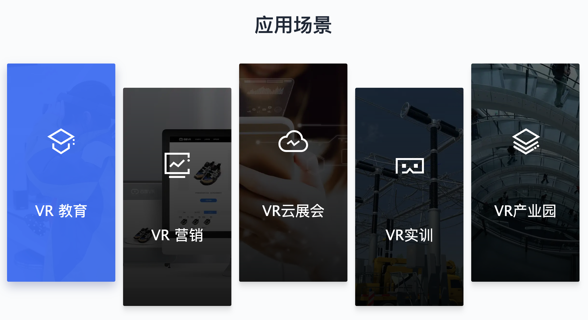
  </column>
  <column width-ratio="0.454674">
  方糖星球：高校开学典礼/粉丝见面会
  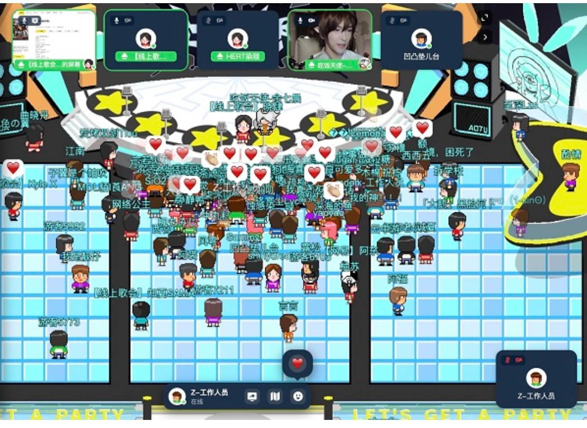
  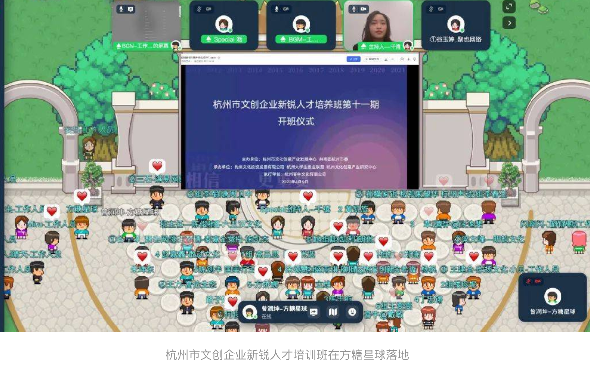
  </column>
  </grid>

### 二、我对元宇宙的观察与思考

##### 1、价值来源：

如果把「元宇宙」粗暴的理解为「赛博空间」，空间能给人提供的价值，我归类为三个：社交价值、内容价值、效率价值

- 社交价值

  - 社交的价值是非常具备网络效应的，无论我是书信交友、邮件/短信交友、QQ交友 还是 微信交友，要么是「我认识的熟人都在上面，我第一时间就能找到」，要么是「我能找到 有趣的灵魂 or 好看的肉体，且他们会喜欢我」，形态只是载体，创造合适的场景并且吸引足够量的人才是关键。
  - 偏向陌生人，社交和社区往往需要场景，这点元宇宙其实可以提供特定的场景和更丰富的交互。例如「知乎」是问答场，「soul」之前是mbti交友场，「陌陌」是约炮场，「blued」是同志交友场，「xx学校/公司/产业园」是lbs交友场；线下的剧本杀和酒吧里面各种交友破冰游戏，其实是真实社交的辅助。
  - 偏向熟人，「可达性」往往是核心诉求。我发短信给我妈，发邮件给同事，发lark给老板，往往是希望马上得到回应/审批通过/获得帮助。这个跟设备的便利性有极大地关系。
- 内容价值

  - 内容的价值往往来自于「自我实现」。我没有经历过的事件、我没有见过的场景，最终给我我没有体验过的情感波动。这点元宇宙其实有很大的优势——能低成本的构建现实中昂贵的场景，并且能超越现实。比如「过山车」就是一个典型的案例。
  - 元宇宙的内容劣势也很明显
  
    - 劣势的天花板是当前的技术，是否能模拟现实/超现实的体验，例如过山车能否给人飞起来的感觉
    - 当前的劣势是内容生态的建设也需要大量的成本。例如迪士尼也还没有把自己的乐园线上化。
    - 本质是「适配技术的全新体验」还需要迭代，当前还在非常初级的阶段。内容能提供的价值和现实世界可能并不完全相同，这块的核心问题点在于需要时间慢慢发育成熟，期间会投入大量的沉没成本。
- 效率价值

  - 效率价值往往在于「虚拟/增强现实 对 真实世界 有裨益」，具体的裨益是什么，需要视产业的特点而结合
  - 以下是一些脑洞和举例
  
    - 医学上，辅助练习人体解刨。目前最像的是visible body（AR版本）
    
      - 延伸：健身领域，专业的「运动示例：肌肉怎么动」应用
      - 延伸：类似xxx的结构是什么应用（例如「榫卯」）
      - 延伸：教育中物理化学实验模拟（例如「烧杯」）（其实roblox最初也是走的这条路）
    - 工业上，M2C模式。消费者在元宇宙自己设计和定制需求，工厂再生产or直接3D打印出来
    
      - 延伸：跨越时间和空间的合作，例如终端店铺去工厂源头考察，直接考察虚拟工厂等。

  <grid>
  <column width-ratio="0.333333">
  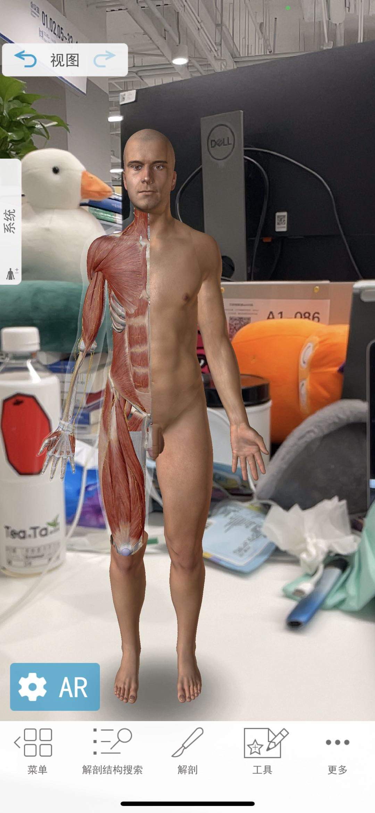
  </column>
  <column width-ratio="0.333333">
  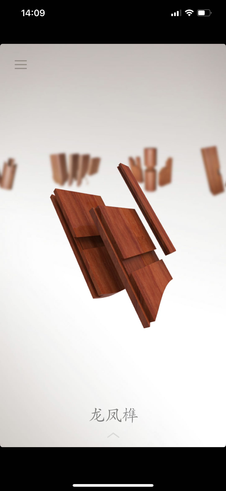
  </column>
  <column width-ratio="0.333333">
  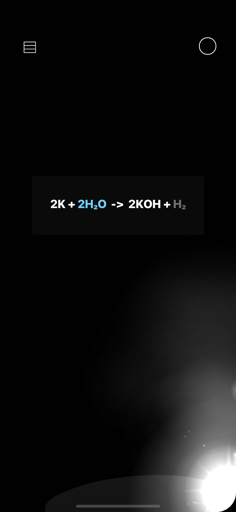
  </column>
  </grid>

##### 2、基于上述价值，元宇宙具备的特点

- 首先介绍一下「元宇宙第一股-roblox」归纳的元宇宙特点

  <grid>
  <column width-ratio="0.681303">
  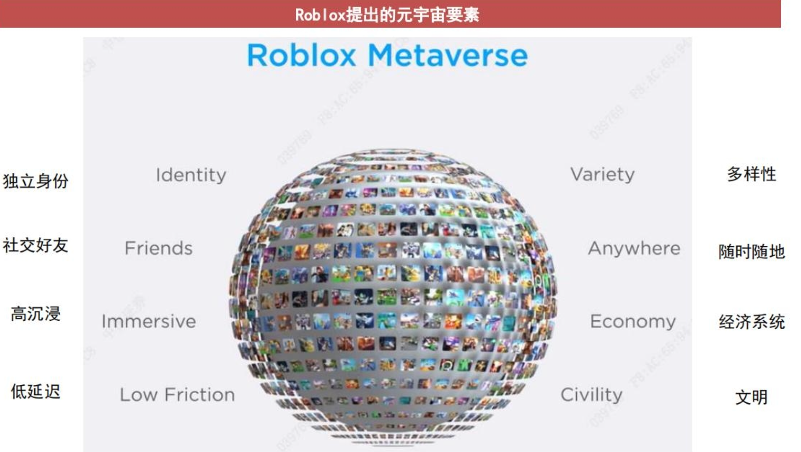
  </column>
  <column width-ratio="0.318697">
  - 独立身份
  - 社交好友
  - 沉浸体验
  - 低延迟
  - 多样性
  - 随时随地
  - 经济系统
  - 文明
  </column>
  </grid>
- 在我心中有这些特点，在特定的场景是非常需要的

  - **基础建设：统一的身份**
  
    - 定义：UID+Avatar一次设置，多应用/多场景复用。
    - 类比：身份证+外表 VS 现实世界；微信/支付宝登录 VS 大多数app；手机号 VS绝大多数注册场景
    - why&how：
    
      - 这个尤其是社交很需要。当前在各个手机应用之间其实有一堵墙，社交关系没有开放出来。但是社交具有网络效应，如果各应用之间的墙被打开，会释放巨大的能量。
      - 新特性是「不可篡改性」，这个是区块链、web3自带的特性，也是降低交易成本的巨大增量价值。
  - **基础建设：统一的货币**
  
    - 定义：
    
      - 一级市场：主流品种有限，发放/回收方式合理，整体货币数量匹配用户和交易规模
      - 二级市场：良好的溯源机制，良好的信用膨胀机制，货币乘数匹配用户和交易规模
    - 类比：现实世界货币
    - why&how：
    
      - 和身份一样，普惠的发放&合理的任务机制能让每个人为经济系统作出贡献；但此处要做好定义，什么是虚拟世界的「工业产值」。此处非常类似web3的「机制」part。
      - 二级市场的交易是元宇宙代币能迈向「货币」的必经之路，在区块链体系下的「可溯源」「不可篡改」会带来「禁止伪币」和「防止假币」两个天然的好处，是机会点。
      - 统一货币在我看来不一定需要「去中心化」，但是至少保证了「规则制定后不可篡改」，这已经对通货膨胀、假币、监管等现实货币的问题带来了巨大的价值
  - **传统要素：丰富的内容 VS 海量的用户**
  
    - 在上述两个基础建设之上，最需要的就是用户，海量用户和海量内容是会形成正反馈的护城河
    - 但是冷启动阶段，首先需要的是优质的内容吸引来第一批种子用户，形成自己的社区内容
    - 所以前期：内容>用户
  - **元宇宙要素：混合现实 & 沉浸体验**
  
    - 这也是最具备元宇宙特性的体验，也是现阶段非常多元，并未形成统一or最优解决方案的part，也是各种创业公司最重要的竞争力所在。这里根据我浅薄的认知找出来一些案例
  
    <readonly-block type="diagram"></readonly-block>
  
    - 我推测越向现实偏移，越适合做产业增强；纯toC会偏向虚拟现实；纯虚拟的尽头是游戏和内容。
  - **元宇宙入口：PC vs Mobile vs XRglass**
  
    - 当前的专用设备（如pico）性价比极低，有很长的路要走，我预测未来3年仍然不是主流场景
    - PC+手机的元宇宙体验可能是当前较好的选择，一个性能强一个便携好，且都较为普及
  
    <grid><column width-ratio="0.375367"></column><column width-ratio="0.624633"><table><colgroup><col/><col/><col/><col/></colgroup><tbody><tr><td>设备</td><td>PC</td><td>手机</td><td>专用设备</td></tr><tr><td>可达性<blockquote>
随时可用
</blockquote></td><td>较高<blockquote>
普及
</blockquote></td><td>极高<blockquote>
普及便携
</blockquote></td><td>低<blockquote>
不便携带普及率低
</blockquote></td></tr><tr><td>沉浸感<blockquote>
与现实剥离
</blockquote></td><td>中<blockquote>
屏幕大
</blockquote></td><td>低<blockquote>
屏幕小
</blockquote></td><td>高<blockquote>
毕竟专用设备
</blockquote></td></tr><tr><td>性价比<blockquote>
性能/价格
</blockquote></td><td>较高<blockquote>
已有设备
</blockquote></td><td>极高<blockquote>
已有+高频
</blockquote></td><td>极低<blockquote>
低频+需购买+性能差
</blockquote></td></tr></tbody></table></column></grid>
  - **元宇宙未来：文明与社区、脑机接口、web3与区块链**
  
    - 在最理想的情况下（基建完善+内容丰富+专用设备普及），混合现实可能取代现在的现实成为新的现实，那个时候的GenerationXR的成长路径可能与我们这代完全不同，从而挖掘元宇宙的更多潜力
    - 专用设备的升级可能是另一个机会。元宇宙的本质是现实的延伸，当前的耳机目镜显然不足以支持便携的需求，而「隐形眼镜」甚至「脑机接口」可能是生物电子发展后的新的选择
    - 区块链orWeb3orNFT在我看来是一回事，他们提供了一种「不可篡改」的全新信用模式，无论是内容、交易还是信息，从国家背书走向数学背书，带来的是**「信用价值」**。区块链技术无论有没有元宇宙都会给世界带来深刻的变革。但是数字信用搭配数字世界显然是原生应用，也许碰撞下会产生新的化学反应。

### 三、教育元宇宙的切入点思考

##### 1、roblox的启迪

roblox创始人David Baszucki，1963年出生于加州，1980年代毕业于斯坦福大学电气工程专业，大学实习期间在通用汽车工作，毕业后创立了Knowledge Revolution——一个二维模拟物理实验的PC软件。该公司98年被MSC收购，收购后David在MSC任高管，并在04年创立了Roblox。

David起初是以「既然二维物理实验被敬业了，我就搞3d吧」的心态做Roblox， 定位于「教育辅助软件」，但其沙盒开放的空间吸引和激发了孩子的创造力，并最终大获成功。

<grid>
<column width-ratio="0.313699">
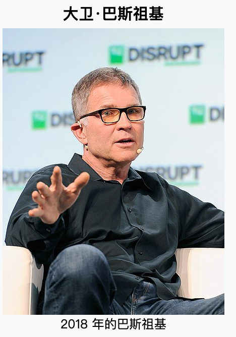
</column>
<column width-ratio="0.686301">
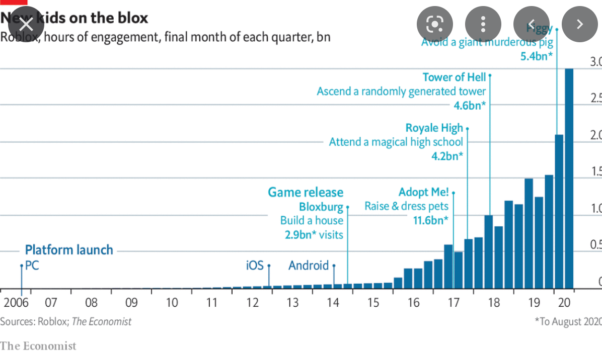
Roblox用增曲线一路向上，22年Q2的DAU已达到6000w
</column>
</grid>

Roblox用增曲线一路向上，22年Q2的DAU已达到6000w

但是其实Roblox画质粗糙，我更愿意称之为「低配版MC」。我认为之所以Roblox能获得如此成功，至少与初期切入的低龄市场没有竞争者密不可分——facebook等主流软件是不许14岁以下青少年注册或者会削减部分功能，但是如之前Roblox截图所示，这款软件是把孩子当做成年人看待，鼓励自由发挥他们的创造力

> 另外引述两篇我认为较好介绍roblox的文章
> 
> [为什么ROBLOX在中国人气不高? - 知乎](https://www.zhihu.com/question/285785551/answer/1971167784)
> 
> [两万字长文：Roblox 从来没想造游戏](https://www.huxiu.com/article/414227.html)（真的很长，有空可以看下，有一些关于未来的洞见）

<grid>
<column width-ratio="0.452055">

</column>
<column width-ratio="0.547945">
- 本截图甚至需要打码
- 腾讯入股roblox，并在中国代理的中国版已经于21年12月下架，下架声明说「我们只是暂时离开，一定会回来的」，然而目前已经接近一年没有消息。
- roblox进入后需要为自己创建角色（含Avatar），然后以此角色可以创造自己的世界或进入别人创造的世界
</column>
</grid>

##### 2、我的建议

- 从教育和学习的本质来说，沉浸式的交互教具其实是切入元宇宙-教育part的正途，类似roblox，不过可能开放学生创造的能力可以弥补精品教具产能不足带来的困扰，但是又无法免除UGC面对的审核风险
- 从激励的角度来说，将激励场景设计成有社交和竞争元素的虚拟世界，并鼓励学生在此世界进行学习是一个非常吸引孩子的toC思路，值得投入资源继续探索边界。